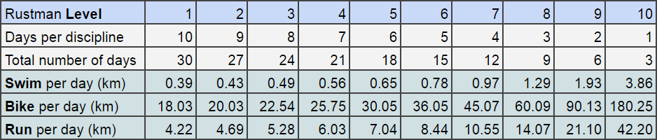
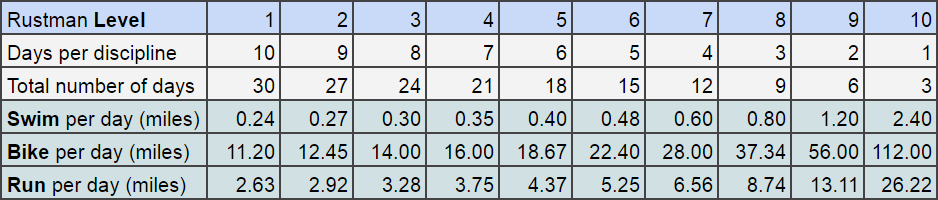

The Rustman Challenge is a _triathlon_ - the distance of an _Ironman_. 
The catch is: You spread it out over several days (up to one month).

It doesn't take much - neither special equipment nor much preparation. 

You can do it alone or complete it as a team!

## Order of Disciplines
You or your team has to do the three disciplines in sequence. 
Each day you or your team has to finish a fraction of the distance of one discipline. 
The order of the disciplines can be freely chosen, but each discipline has to be completed before the next one starts.

## Rustman Level
The Rustman Challenge is designed to scale with your ability. 
For a Rustman Level 1 you complete a tenth of one discipline of an Ironman per day, 10 consecutive days per discipline (total of 30 days).
For a Rustman Level 2 you complete a ninth of one discipline of an Ironman per day, 9 consecutive days per discipline (total of 27 days).
For a Rustman Level 3 you complete an eighth, for 8 days per discipline; and so forth (total of 24 days).
Level 10 is the highest level and it consists of completing the full distance of one discipline per day (for a total of 3 days).

Here's a table in kilometers:

And the same table for our friends that prefer to think in miles:

Let's look at a couple of examples:

For instance the distances for a Rustman Level 1 are:

* 10 x 390 meters (0.24 miles) swimming
* 10 x 18.1 km (11.2 miles) biking
* 10 x 4.22 km (2.622 miles) running

If you do it as a relay, and for instance your team decides on the following (classical) order: swimming, biking, running. 
The swimmer has to start with 10 *consecutive* days of at least 390 meters (0.24 miles), 
the biker has to do the next 10 *consecutive* days of at least 18.1km (11.2 miles), 
and the runner finishes with 10 *consecutive* days of at least 4.22km (2.622miles) of running.

The commitment of each participant is 10 consecutive days of sport and 20 days of support for the teammates.

Let's do another example. You decide to do a Rustman Level 3:
* 8 x 490 meters swimming
* 8 x 22.54 km biking
* 8 x 5.28 km running

Let's say you decide to do it as an individual and you decided on the following order: biking, swimming, running. 
You do *8 consecutive days* of at least 22.54 km biking, 
followed by *8 consecutive days* of at least 490 meters of swimming, 
and another *8 consecutive days* of at least 5.28 km of running. 

Your commitment for a Rustman Level 3 is: 24 consecutive days of sport.

## Relay vs. Solo
You can either do the Rustman solo, which means you do all 3 disciplines in a row, or you do it as a relay!

All it takes for the relay is three friends and a commitment!
You need a one swimmer, one biker and one runner. 

The Rustman Levels and rules are the same for _solo_ and for _relay_, 
but in the _relay_ each participant does only one discipline!

## Exceptions
### Solo
There are no exceptions. Each race-day needs to be completed! 

### Relay 
If one participant cannot complete one of her/his race-days, 
the other two teammates can choose to (both!) fill in. 
Which means that they both have to complete this day for their mate. 
They can do it together or individually but they must both do the full distance for this day.

That's all! As simple as that!

## Some more Advice
### Choose the right level
Start with a level that you are confident you can complete. 
If you aren't into sports doing it as a relay is highly recommended. 
It gives the extra motivation to complete it.

### Make it social! 
Motivate others to do it as a relay or to do a rustman at the same time as you do.
Meet with your teammates or competitors before the challenge starts and plan it out. 
Go for lunch/coffee/dinner in the transition days! 
Help each other out! Keep each other motivated! 
Create a Whatsapp group for your team and competitors. 
Share your run/bike/swim! There are plenty of apps that make it easy to share.
### Tell others!
You can get support from your team and through competition, but usually it also helps if you make a commitment and share it with others. 
Simply tell your friends and family. 
Maybe they join you on a race-day or cheer you up during the Rustman or towards the end.
### Make it fun!
Yep - keep it fun! If one of your teammates drops out - don't quit your friendship. 
It's just a silly competition after all.
### Take it serious!
Although, compared to a Ironman the Rustman challenge sounds easy - do not underestimate it!
Most people struggle to make time for sport. That's precisely the idea of the challenge:
Commit and support each other to complete all consecutive days of physical exercise.
If you don't feel fit enough to complete any of the race distances, better see a doctor and plan to do some serious lifestyle changes before you do anything else.

## FAQ
* Can I do it at the gym?  
Yes! Rustman is designed to easily fit your schedule and flexible with seasons! There are no rules about where and how you complete your race-days. If it's too hot or cold outside simply do it at the gym!

* Do all teammates have to be there on each race-day? 
No! Everyone completes their race-days individually. Just tell the others that you did it every day!

* Can someone join me on my run/bikeride/swim? 
Yes! Bring your teammates/friends/family with you on your race-days. Everything that helps you to get through the race-days is allowed.

* Can we pause the race and resume after a day or two? 
No! This is the only requirement. 
It has to be consecutive race-days for the whole distance! 
If you skip one day you are out! 
You need to plan the competition (together with your team). 

## We would like to hear back from you!
Send us a mail and tell us your experience or get something clarified! 

Mail: [rustmanrace@gmail.com](mailto:rustmanrace@gmail.com)